# **Clases, atributos, metodos y responsabilidades**  

Se representarán todas las clases base detectadas como necesarias para
resolver el problema, con sus atributos, métodos y responsabilidades.  
De acuerdo a como se vayan presentando problemas o se adquieran nuevos conocimientos, estas pueden ir cambiando.

#### Diagrama de Entidad Relación.
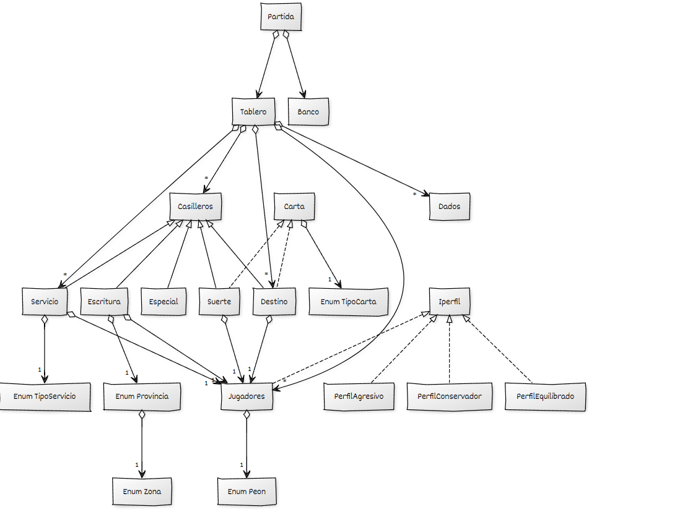


#### Clase: Bancos.
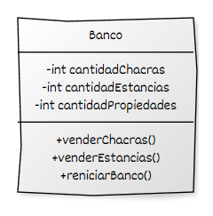
```
  Descripción: Esta clase representa la entidad bancaria dentro del juego. 
  Se encarga de gestionar las transacciones financieras entre los jugadores,
  así como la compra y venta de propiedades.
  También puede mantener un registro de la cantidad de dinero y los 
  casilleros disponibles en el juego.
```

| Atributo            | Tipo     | Descripción                                                |
|:--------------------| :------- |:-----------------------------------------------------------|
| `cantidadChacras`   | `int` | Indica la cantidad de chacras disponibles para la venta.   |
| `cantidadEstancias` | `int` | Indica la cantidad de estancias disponibles para la venta. |
| `cantidadPropiedades`    | `int` | Indica la catidad de escrituras disponibles para la venta. |

| Métodos | Descripción              |
| :--------| :------------------------- |
| `VenderCampos()` | Método que descuenta cantidad de campos.|
| `VenderChacras()` | Método que descuenta cantidad de chacras.|


#### Clase: Cartas.
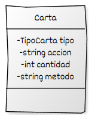
```
  Descripción: Esta clase representa una entidad de juego con atributos que determinan su tipo y acción.
  El atributo TipoCarta tipo indica si es de suerte o destino.El atributo String accion describe la acción.
  También incluye los atributos int cantidad y String metodo, y un constructor que inicializa la entidad 
  con el tipo especificado.
```

| Atributo   | Tipo        | Descripción                                              |
|:-----------|:------------|:---------------------------------------------------------|
| `tipo`     | `TipoCarta` | Enum que indica que tipo de carta es, suerte o destino.  |
| `accion`   | `string`    | Indica la descripción de la acción que realiza la carta. |
| `cantidad` | `int`       | Indica cantidad de monto que cobra o paga el jugador.    |
| `metodo`   | `string`    | Indica el nombre del método que realiza                  |


#### Clase: Casilleros.
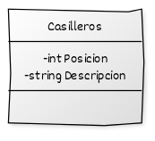
```
  Descripción: Esta clase representa los casilleros del tablero de juego. 
  Cada casillero tiene un valor asociado que puede influir en las acciones de los 
  jugadores al caer en él, y un color que puede indicar una categoría o propiedad  específica.
  La clase puede incluir métodos para gestionar la interacción de los jugadores con los 
  casilleros.
```

| Atributo | Tipo     | Descripción                                     |
| :-------- |:---------|:------------------------------------------------|
| `Posicion` | `int`    | Indica el posición del casillero en el tablero. |
| `Descripción` | `string` | Indica una descripción.                         |


#### Clase: Casilleros Especiales.
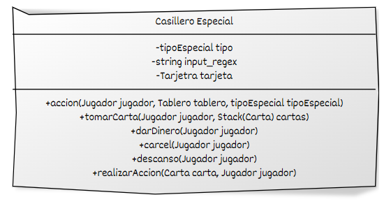
```
  Descripción: Esta clase representa los casilleros especiales del tablero de juego. 
  Cada casillero tiene un valor asociado que puede influir en las acciones de los 
  jugadores al caer en él.
  La clase puede incluir métodos para gestionar la interacción de los jugadores con los 
  casilleros.
```

| Atributo       | Tipo      | Descripción                                                                                                             |
|:---------------|:----------|:------------------------------------------------------------------------------------------------------------------------|
| `tipo` | `tipoEspecial`    | Enum que indica el tipo de casillero que puede ser SUERTE,DESTINO,CARCEL,IMPUESTO,MPRESO,DESCANSO,ELIBRE,SALIDA,PREMIO. |
| `input_regex`  | `string`  | String que usa el método regex para verificar una opción coincide o no con lo esperado.                                 |
| `tarjeta`      | `Tarjeta` | Instancia de la clase tarjeta.                                                                                          |

| Métodos                                                               | Descripción                                                                                                                                                                                                                           |
|:----------------------------------------------------------------------|:--------------------------------------------------------------------------------------------------------------------------------------------------------------------------------------------------------------------------------------|
| `accion(Jugador jugador, Tablero tablero, tipoEspecial tipoEspecial)` | Método que toma por parámetro al jugador, tablero y tipoEspecial de casillero. Este método le asigna la acción que debe hacer el jugador cuando caiga en suerte, destino, descanso, cárcel, estacionamiento libre, premio o impuesto. |
| `tomarCarta(Jugador jugador, Stack<Carta> cartas)` | Toma como parámetros al jugador de turno y el stack de cartas. El método hace que el jugador saque una carta, la devuelva y realice la acción de la carta. |
| `darDinero(Jugador jugador)` | Toma como parámetros al jugador. Cuando el jugador caiga en casilleros especiales, se le dará o restará dinero de su cuenta. |
| `carcel(Jugador jugador)` | Toma como parámetro al jugador y llama al método marchePreso() del jugador.|
| `descanso(Jugador jugador)` | Toma como parámetro al jugador y llama al método iniciarDescanso() del jugador.|
| `realizarAccion(Carta carta, Jugador jugador)`  | Toma como parámetros una carta y un jugador. Dependiendo del string que sea su método, se llamará al método correspondiente de la tarjeta.|


#### Clase: Dados.
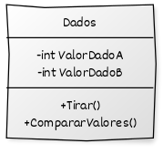
```
  Descripción: La clase "Dados" modela un par de dados, con la capacidad de generar valores 
  aleatorios para cada dado y comparar si los valores obtenidos son idénticos. 
  Esta clase es útil para simular lanzamientos de dados en juegos o aplicaciones que requieren 
  aleatoriedad en los resultados.
```

| Atributo | Tipo    | Descripción                           |
| :-------- |:--------|:--------------------------------------|
| `ValoreDadoA` | `int`   | Indica el valor de unos de los dados. |
| `ValoreDadoB` | `int`   | Indica el valor de unos de los dados. |

| Métodos             | Descripción                                                     |
|:--------------------|:----------------------------------------------------------------|
| `tirarDados()`      | Método que randomiza los valores de puedan tomar el Dado A y B. |
| `CompararValores()` | Método que si sales 2 números iguales.                          |


#### Clase: Destinos.
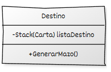
```
  Descripción: La clase "Destinos" representa tarjetas de destino en un juego, que pueden afectar
  al jugador con diversos inconvenientes. 
  Estas tarjetas pueden activarse o no, influenciando el curso del juego. 
  Esencial en juegos de mesa o simulaciones donde se quiera añadir aleatoriedad 
  y desafíos adicionales para los jugadores.
```

| Atributo       | Tipo      | Descripción                                                                |
|:---------------|:----------|:---------------------------------------------------------------------------|
| `listaDestino` | `Stack<Carta>` | Stack que contiene cada una de las instancias de cartas destino del juego. |

| Métodos | Descripción                                             |
| :--------|:--------------------------------------------------------|
| `GenerarMazo()` |Método que instancia cada una de las cartas y las añade a la lista de destino. |


#### Clase: Escrituras.
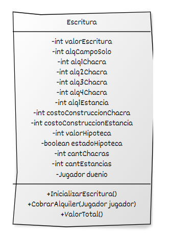
```
Descripción: La clase "Escrituras" representa títulos de propiedad de bienes raíces, con 
atributos que describen aspectos como el valor de compra, alquiler y hipoteca, así como la 
cantidad y tipo de propiedades incluidas. Con métodos para comprar, vender y gestionar el 
alquiler de las escrituras,ofrece funcionalidades esenciales para juegos de mesa o 
simulaciones inmobiliarias. 
Ideal para aplicaciones donde se simule la gestión y negociación de bienes raíces entre jugadores.
```

| Atributo                    | Tipo        | Descripción                                                     |
|:----------------------------|:------------|:----------------------------------------------------------------|
| `idEscritura`               | `string`    | Valor con el que se indentifica la escritura.                   |
| `provincia`                 | `Provincia` | Enum que indica el nombre de provincia.                         |
| `zona`                      | `Zona`      | Enum que indica el nombre de provincia.                         |
| `valorEscritura`            | `int`       | Indica el valor de compra de la escritrura.                     |
| `alqCampoSolo`              | `int`       | Indica el valor de alquiler de la escritrura sola.              |
| `alq1Chacra`                | `int`       | Indica el valor de alquiler de la escritrura con 1 chacra.      |
| `alq2Chacra`                | `int`       | Indica el valor de alquiler de la escritrura con 2 chacras.     |
| `alq3Chacra`                | `int`       | Indica el valor de alquiler de la escritrura con 3 chacras.     |
| `alq4Chacra`                | `int`       | Indica el valor de alquiler de la escritrura con 4 chacras.     |
| `costoConstruccionChacra`   | `int`       | Indica el valor de construccion de 1 chacra en la provincia .   |
| `costoConstruccionEstancia` | `int`       | Indica el valor de construccion de 1 estancia en la provincia . |
| `valorHipoteca`             | `int`       | Indica el valor de hipoteca de las propiedades.                 |
| `estadoHipoteca`            | `boolean`   | Indica si la escritura esta hipotecada o no.                    |
| `cantChacras`               | `int`       | Indica a cantidad de chacras en la escritura.                   |
| `cantEstancias`             | `int`       | Indica a cantidad de estancias en la escritura.                 |
| `duenio;`                   | `Jugador`   | Indica el propietario de la escritura.                          |

| Métodos | Descripción                                                                                        |
| :--------|:---------------------------------------------------------------------------------------------------|
| `InicializarEscritura()` | Método que inicializa el mazo de cartas de escrituras y las añade.                                |
| `ProvinciaCompleta(Escritura escritura)` | Método que verifica si el jugador posee todas las escrituras de una provincia.             |
| `CobrarAlquiler(Jugador jugador)` | Método que cobra al jugador un alquiler dependiendo de si hay construcciones en la propiedad o no. |
| `ValorTotal()` | Método que calcula el patrimonio total del jugador.                                                |


#### Clase: Jugadores.
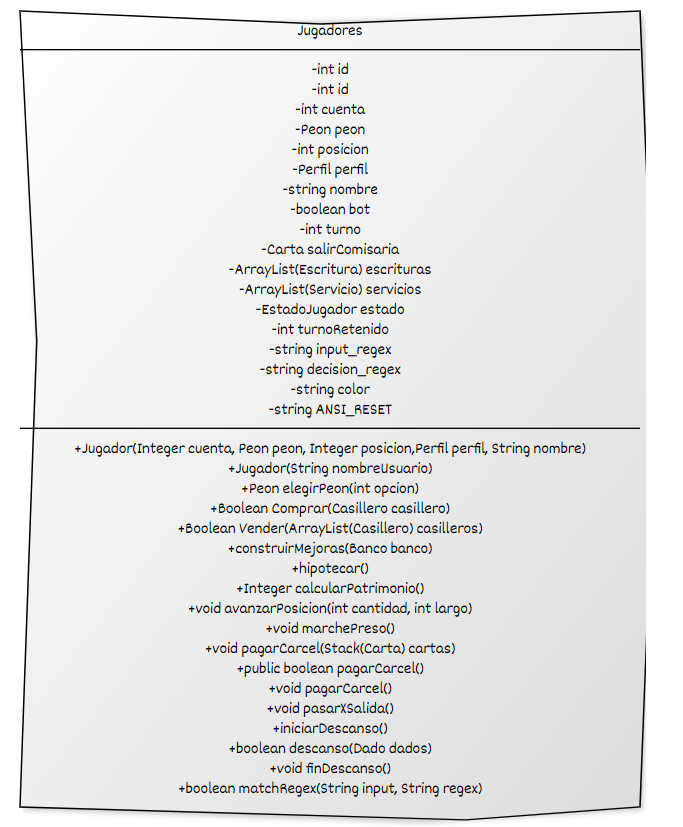
```
Descripción: La clase "Jugadores" representa a los participantes en el juego, con atributos que 
incluyen su saldo en cuenta, la pieza que los representa en el tablero y su perfil de jugador 
según la dificultad seleccionada. 
Con métodos para mejorar propiedades adquiridas y hipotecar escrituras o servicios, ofrece
la capacidad de gestionar el progreso y las estrategias financieras de cada jugador. 
Esencial en juegos de mesa y simulaciones donde se simule la competencia y la gestión de recursos 
entre múltiples participantes.
```

| Atributo               | Tipo            | Descripción                                                                          |
|:-----------------------|:----------------|:-------------------------------------------------------------------------------------|
| `id`                   | `int`           | Número para identificar al jugador.                                                  |
| `cuenta`               | `int`           | Cantidad de dinero del Jugador.                                                      |
| `peon`                 | `Peon`          | Enum que indica el color del jugador en la partida.                                  |
| `posicion`             | `int`           | Posición del jugador en el tablero.                                                  |
| `perfil`               | `Perfil`        | Atributo utilizado para la creación de los bots; en caso del jugador humano es null. |
| `nombre`               | `string`        | nombre que se le asigna a cada jugador.                                              |
| `turno`                | `int`           | Número que se obtiene en el dado para asignar el turno.                              |
| `salirComisaria`       | `Carta`         | Indica si tiene la carta de destino o suerte para salir de la comisaría.             |
| `ArrayList<Escritura>` | `escrituras`    | Lista de escrituras que tiene el jugador a su nombre. .                              |
| `ArrayList<Servicio>`  | `servicios`     | Lista de escrituras que tiene el jugador a su nombre. .                              |
| `estado`               | `EstadoJugador` | Enum que indica los posibles estados del jugador: VIVO, QUIEBRA, GANADOR.            |
| `turnoRetenido`        | `int`           | Cantidad de turnos que el jugador está retenido en la cárcel.                        |
| `input_regex`          | `string`        | Se utiliza para métodos de validaciones en preguntas.                                |
| `decision_regex`       | `string`        | Idem anterior.                                                                       |
| `color`                | `string`        | Variable vacía que se usará para asignar colores a las variables.                                                                       |
| `ANSI_RESET`           | `string`        | Variable que se usa para cambiar a blanco las líneas del tablero.                                                                       |


| Métodos                                                                          | Descripción                                                                                         |
|:---------------------------------------------------------------------------------|:----------------------------------------------------------------------------------------------------|
| Jugador(Integer cuenta, Peon peon, Integer posicion,Perfil perfil, String nombre)| Constructor que se usa para crear un bot.                                                           |
| Jugador(String nombreUsuario)                                                    | Constructor que se usa para crear el jugador del usuario.                                           |
| elegirPeon(int opcion)                                                           | Devuelve el peón del jugador y asigna un color al nombre al jugador y peón del mismo.               |
| Comprar(Casillero casillero)                                                     | Permite al jugador comprar un casillero.                                                            |
| Vender(ArrayList<Casillero> casilleros)                                          | Lista las escrituras de un jugador y le permite venderlas.                                          |
| construirMejoras(Banco banco)                                                    | Permite al jugador construir mejoras (chacras y estancias) al tener una provincia completa.         |
| hipotecar()                                                                      | Permite hipotecar al jugador cuando su cuenta está en 0 o termina con saldo negativo.               |
| calcularPatrimonio()                                                             | Calcula el patrimonio de los jugadores.                                                             |
| avanzarPosicion(int cantidad, int largo)                                         | Hace que el jugador avance en el tablero.                                                           |
| marchePreso()                                                                    | Setea al jugador la posición de la cárcel en el tablero y lo retiene 2 turnos.                      |
| pagarCarcel(Stack<Carta> cartas)                                                 | Paga la cárcel usando la carta de salida libre.                                                     |
| pagarCarcel()                                                                    | Paga la cárcel, descuenta $1000 directamente de la cuenta del jugador.                              |
| pasarXSalida()                                                                   | Da $5000 al jugador cuando pasa por la salida.                                                      |
| iniciarDescanso()                                                                | Setea a 3 los turnos que el jugador no hace nada.                                                   |
| descanso(Dado dados)                                                             | Toma por parámetro dados, llama al método tirar dados y compara valores, retornando true o false.   |
| finDescanso()                                                                    | Setea a 0 el turno retenido del jugador.                                                            |
| matchRegex(String input, String regex)                                           | Compara las respuestas ingresadas para preguntas.                                                   |


#### Clase: Partidas.
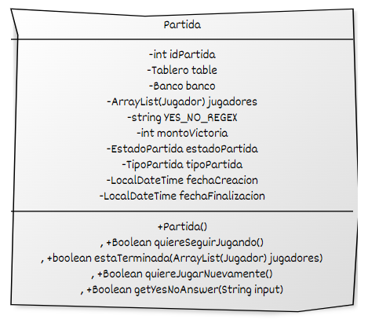
```
Descripción: La clase "Partidas" coordina el desarrollo de la partida, gestionando el tablero
y el banco. 
Sus métodos determinan el ganador según el máximo capital alcanzado o la adquisición de todas 
las escrituras. 
Además, configura la dificultad y asigna perfiles a los jugadores, y reparte el dinero inicial. 
Es esencial para juegos de mesa o simulaciones con competencia financiera y estratégica entre 
múltiples jugadores.
```

| Atributo               | Tipo            | Descripción                                                                          |
|:-----------------------|:----------------|:-------------------------------------------------------------------------------------|
| idPartida         | int                 | Número que indica el número de la partida.                                                    |
| table             | Tablero             | Instancia del tablero utilizado en la partida.                                                |
| banco             | Banco               | Instancia del banco utilizado en la partida.                                                  |
| jugadores         | ArrayList<Jugador>  | Listado de jugadores que participan en la partida.                                            |
| YES_NO_REGEX      | String              | Cadena utilizada para validar respuestas sí/no.                                               |
| montoVictoria     | int                 | Monto de capital necesario para que un jugador gane la partida.                               |
| estadoPartida     | EstadoPartida       | Enum que indica el estado de la partida: FINALIZADO, ENJUEGO, CANCELADO.                      |
| tipoPartida       | TipoPartida         | Enum que indica el tipo de partida: BANCARROTA, MONTOMAX.                                     |
| fechaCreacion     | LocalDateTime       | Fecha de creación de la partida.                                                              |
| fechaFinalizacion | LocalDateTime       | Fecha de finalización de la partida.                                                          |


| Métodos                            | Descripción                                                                                       |
|:-----------------------------------|:--------------------------------------------------------------------------------------------------|
| + Partida()                         | Método constructor que instancia una nueva partida.                                                |
| + Boolean quiereSeguirJugando()     | Método que consulta si un jugador quiere seguir jugando.                                           |
| + boolean estaTerminada(ArrayList<Jugador> jugadores) | Método que devuelve true si la partida está terminada.                                      |
| + Boolean quiereJugarNuevamente()   | Método que indica si un jugador quiere jugar nuevamente o no.                                      |
| + Boolean getYesNoAnswer(String input) | Método similar a `matchRegex()` que devuelve true o false según la respuesta ingresada.        |


#### Clase: Perfil Agresivo.
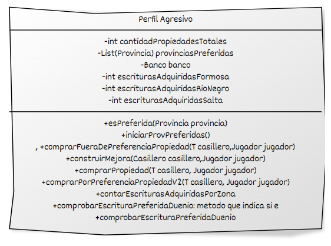
```
Descripción: a. Este jugador busca maximizar el retorno de inversión rápidamente,
 incluso a costa de correr mayores riesgos. (Provincias prioritarias:
 Tucuman, Córdoba y Buenos Aires)
 b. Este jugador buscará comprar la serie de Ferrocarriles y Companias.
 c. Este jugador no comprará fuera de las provincias de preferencia a no
 ser que ya se hayan vendido a otros jugadores al menos una propiedad
 de todas sus zonas de preferencia o el mismo haya completado sus
 zonas; en dicho caso, comprará tantas propiedades como pueda.
 d. Priorizará la expansión rápida y construirá mejoras cada vez que
 pueda.
 
El método "CompararPreferencias()" permite evaluar si una escritura en el tablero coincide 
con las preferencias del bot para decidir su compra.
Esencial en juegos donde se simule la toma de decisiones de los jugadores o bots basada
en criterios predefinidos, agregando profundidad estratégica y realismo al juego.
```

| Atributos                              | Tipo                   | Descripción                                                                                       |
|:---------------------------------------|:-----------------------|:--------------------------------------------------------------------------------------------------|
| cantidadPropiedadesTotales              | `int`                  | Número total de propiedades.                                                                      |
| provinciasPreferidas                    | `List<Provincia>`      | Lista de provincias preferidas.                                                                   |
| banco                                  | `Banco`                | Instancia del banco.                                                                              |
| escriturasAdquiridasFormosa             | `int`                  | Número de escrituras adquiridas en Formosa.                                                       |
| escriturasAdquiridasRioNegro            | `int`                  | Número de escrituras adquiridas en Río Negro.                                                     |
| escriturasAdquiridasSalta               | `int`                  | Número de escrituras adquiridas en Salta.                                                         |


| Métodos                                                         | Descripción                                                                                       |
|:----------------------------------------------------------------|:--------------------------------------------------------------------------------------------------|
| + esPreferida(Provincia provincia)                              | Método que analiza si una escritura está dentro de sus preferencias.                              |
| + iniciarProvPreferidas()                                       | Método que inicia la lista de las provincias preferidas.                                          |
| + comprarFueraDePreferenciaPropiedad(T casillero, Jugador jugador) | Permite comprar una escritura por fuera de sus preferencias.                                      |
| + construirMejora(Casillero casillero, Jugador jugador)         | Permite construir en una provincia cuando tiene las escrituras de una provincia completa.         |
| + comprarPropiedad(T casillero, Jugador jugador)                | Método que permite al bot comprar la propiedad que desee.                                         |
| + comprarPorPreferenciaPropiedadV2(T casillero, Jugador jugador)| Método que permite al bot comprar la propiedad que desee.                                         |
| + contarEscriturasAdquiridasPorZona()                           | Método que indica la cantidad de escrituras adquiridas por zona.                                  |
| + comprobarEscrituraPreferidaDuenio()                           | Método que indica si la escritura es la preferida por el dueño.                                   |

#### Clase: Perfil Conservador.
```
Descripción: Perfil de jugador conservador:
 a. Este jugador tiende a ser cauteloso y prioriza la acumulación de
 propiedades de bajo costo. (Provincias prioritarias: Formosa, Río Negro
 y Salta)
 b. Este jugador comprará fuera de las provincias de preferencia 1 de cada
 5 propiedades que compre.
 c. Construirá mejoras solo cuando el costo de la construcción no
 sobrepase el 30% de su dinero en cuenta.
 
Los atributos cambiaran para el tipo de provincias, en este caso seran Formosa, Rio Negro y Salta.
Los metodos son semejantes y tiene la misma funicionalidad,
```

#### Clase: Perfil Equilibrado.
```
Descripción: Perfil de jugador equilibrado:
 a. Este jugador busca un equilibrio entre la acumulación de propiedades
 y la construcción de mejoras. (Provincias prioritarias: Mendoza, Santa
 Fe y Tucuman)
 b. Este jugador buscará comprar la serie de Ferrocarriles.
 c. Este jugador comprará fuera de las provincias de preferencia 1 de cada
 3 propiedades que compre.
 d. Construirá mejoras cuando el costo de la construcción no supere el
 50% de su dinero en cuenta o cuando se hayan vendido más del 75%
 de las propiedades.
 
Los atributos cambiaran para el tipo de provincias, en este caso seran Formosa, Rio Negro y Salta.
Los metodos son semejantes y tiene la misma funicionalidad,
```

#### Clase: Servicio.
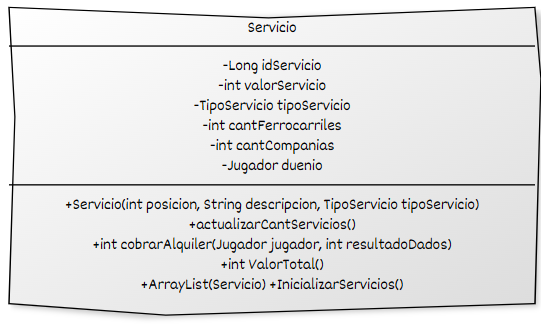
```
Descripción: 
La clase Servicio modela servicios en un juego con atributos como idServicio, valorServicio, 
y tipoServicio (como FERROCARRIL o COMPANIA). 
Permite calcular alquileres basados en posesiones y valor total del servicio, facilitando la gestión 
y el cálculo de patrimonio en el contexto del juego o sistema implementado.
```

| Atributo              | Tipo                   | Descripción                                                                                       |
|-----------------------|------------------------|---------------------------------------------------------------------------------------------------|
| idServicio            | Long                   | Número para identificar el servicio.                                                               |
| valorServicio         | Integer                | Precio de cada uno de los servicios.                                                               |
| tipoServicio          | TipoServicio           | Enum que indica el tipo de servicio (FERROCARRIL, COMPANIA).                                      |
| cantFerrocarriles     | Integer                | Cantidad de ferrocarriles que tiene el servicio.                                                   |
| cantCompanias         | Integer                | Cantidad de compañías (puede ser Petrolera, Ingenio o Bodega) que tiene el servicio.               |
| duenio                | Jugador                | Jugador que es dueño del servicio.                                                                 |

### Métodos:

| Método                   | Descripción                                                                                       |
|--------------------------|---------------------------------------------------------------------------------------------------|
| `actualizarCantServicios()` | Método que cuenta cuántos servicios hay de cada tipo (FERROCARRIL o COMPANIA).                    |
| `cobrarAlquiler(Jugador jugador, int resultadoDados)` | Método que retorna el alquiler que debe pagar un jugador por utilizar el servicio.|
| `ValorTotal()`           | Método que devuelve el valor total del servicio, utilizado para calcular el patrimonio del jugador. |
| `ArrayList<Servicio> InicializarServicios()` | Método que inicializa los servicios y los agrega a la lista de servicios del tablero.             |

#### Clase: Suertes.
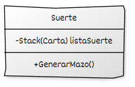
```
Descripción: La clase "Suertes" gestiona eventos aleatorios beneficiosos para el jugador durante 
el juego.
Con métodos para asignar diferentes ayudas al jugador, como bonificaciones financieras o ventajas
estratégicas, añade un elemento de incertidumbre y emoción al juego.
Esencial en juegos de mesa donde se busque añadir variedad y sorpresa, proporcionando
oportunidades inesperadas para los jugadores y manteniendo el interés a lo largo de la partida.
```

| Atributo      | Tipo           | Descripción                                                               |
|:--------------|:---------------|:--------------------------------------------------------------------------|
| `listaSuerte` | `Stack(Carta)` | Stack que contiene cada una de las instancias de cartas suerte del juego. |

| Métodos | Descripción                                       |
| :--------|:--------------------------------------------------|
| `Stack<Carta> GenerarMazo()` | Método que genera el maso de de cartas de suerte. |


#### Clase: Tablero.
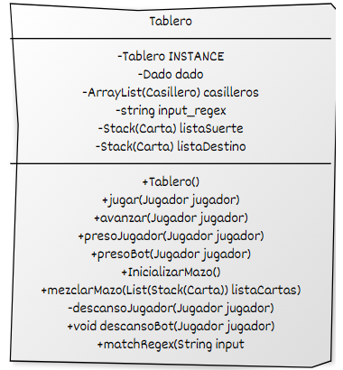
```
Descripción: La clase "Tableros" representa el tablero de juego en el cual se desarrollan las 
partidas.
Con instancias de jugadores, dados y casilleros, coordina el progreso de la partida y las
interacciones entre los elementos del juego. Su método "Avanza()" determina cuántos casilleros 
debe avanzar el peón del jugador en su turno, controlando así el movimiento dentro del tablero. 
Es central en juegos de mesa, proporcionando la estructura y la mecánica fundamental para la 
jugabilidad y la progresión del juego.
```

| Atributo               | Tipo                        | Descripción                                                                                       |
|------------------------|-----------------------------|---------------------------------------------------------------------------------------------------|
| INSTANCE               | Tablero                     | Instancia única del tablero utilizando el patrón Singleton.                                         |
| dado                   | Dado                        | Instancia de los dados utilizados en el juego.                                                      |
| casilleros             | ArrayList<Casillero>        | Lista de casilleros que conforman el tablero.                                                       |
| input_regex            | String                      | Expresión regular utilizada para validaciones de entrada.                                            |
| listaSuerte            | Stack<Carta>                | Pila de cartas de la suerte disponibles en el juego.                                                |
| listaDestino           | Stack<Carta>                | Pila de cartas de destino disponibles en el juego.                                                  |


| Método                | Descripción                                                                                      |
|-----------------------|--------------------------------------------------------------------------------------------------|
| `Tablero()`           | Constructor de la clase `Tablero` sin parámetros.                                                  |
| `jugar(Jugador jugador)` | Asigna los turnos de los jugadores, saltando a los jugadores en la cárcel.                        |
| `avanzar(Jugador jugador)` | Tira los dados y hace avanzar al jugador según el resultado, permitiendo tiradas adicionales por dobles. Si se sacan dobles tres veces seguidas, el jugador va a la cárcel. |
| `presoJugador(Jugador jugador)` | Maneja la situación del jugador en la cárcel, permitiendo pagar una fianza o tirar dobles para salir. |
| `presoBot(Jugador jugador)` | Similar a `presoJugador`, pero automatizado para bots.                                            |
| `InicializarMazo()`   | Inicializa las pilas de cartas (suerte y destino).                                                |
| `mezclarMazo(List<Stack<Carta>> listaCartas)` | Mezcla el orden de las pilas de cartas proporcionadas.                                         |
| `descansoJugador(Jugador jugador)` | Pregunta al jugador si desea descansar o no durante su turno.                                   |
| `descansoBot(Jugador jugador)` | Similar a `descansoJugador`, aplicado automáticamente para bots.                              |
| `matchRegex(String input)` | Verifica si una entrada coincide con la expresión regular definida para validaciones.           |


#### Clase: Tarjeta.
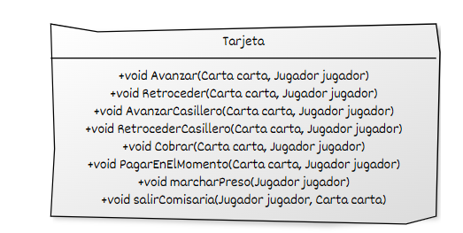
```
Descripción: La clase abstracta Tarjeta define métodos para manejar diversas acciones de tarjetas en un juego, 
como avanzar, retroceder, cobrar, pagar y otras acciones específicas según las cartas.
Es parte de la estructura para manejar eventos y efectos de tarjetas dentro del juego implementado.
```
| Método                         | Descripción                                                                                   |
|--------------------------------|-----------------------------------------------------------------------------------------------|
| `Avanzar(Carta carta, Jugador jugador)`            | Avanza al jugador según el número de casilleros especificado en la carta.                     |
| ` Retroceder(Carta carta, Jugador jugador)`         | Retrocede al jugador según el número de casilleros especificado en la carta.                   |
| `AvanzarCasillero(Carta carta, Jugador jugador)`   | Mueve al jugador a una posición específica según la carta proporcionada.                      |
| `RetrocederCasillero(Carta carta, Jugador jugador)`| Mueve al jugador a una posición específica hacia atrás según la carta proporcionada.          |
| `Cobrar(Carta carta, Jugador jugador)`             | Aumenta el saldo del jugador según el monto especificado en la carta.                          |
| `PagarEnElMomento(Carta carta, Jugador jugador)`   | Reduce el saldo del jugador según el monto calculado con base en las propiedades que posee.   |
| `marcharPreso(Jugador jugador)`                    | Envía al jugador a la posición de la comisaría (posición 14).                                 |
| `salirComisaria(Jugador jugador, Carta carta)`     | Permite al jugador salir de la comisaría si tiene la carta adecuada, de lo contrario, la obtiene. |
